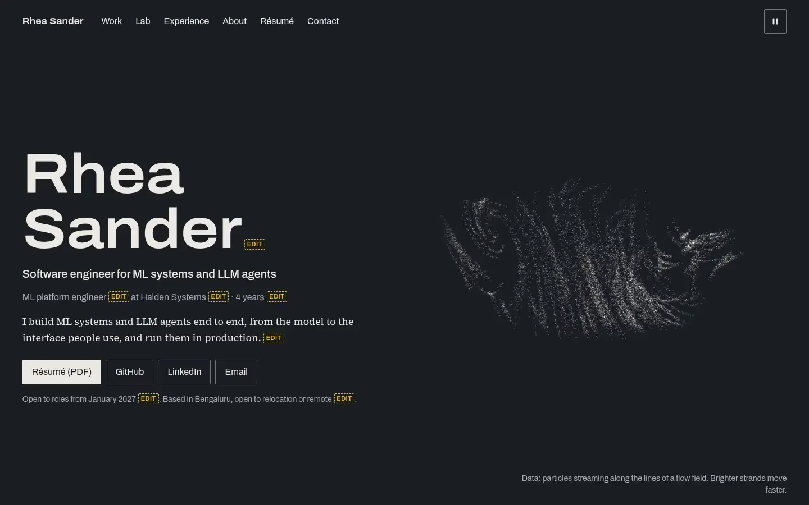

# Portfolio

The portfolio of an SDE, LLM and AI/ML engineer. A static Astro site with one
persistent three.js particle world behind it, three interactive Lab demos, and
a 3D explorer for each project's architecture, all inside measured budgets that
CI enforces on every push.



More screenshots, at 390 px and 1440 px in both themes: [`docs/screenshots/`](docs/screenshots/).
A plain-language tour of the code, phase by phase: [`docs/walkthrough.md`](docs/walkthrough.md).
The full design and graphics specification, with each phase's results: [`PLAN.md`](PLAN.md).

## What it does

- **One world, many meanings.** A single particle system runs through the whole
  site and reshapes into five formations, each standing for something real:
  - a data flow field;
  - a neural network with a forward pass;
  - a sentence being generated, with attention arcs;
  - a service graph with request packets;
  - a knot that joins all three roles.

  Scrolling blends between them. Project pages show the world as a quiet band
  above the text.

- **Architecture explorer.** "Explore in 3D" on a project page morphs the same
  particles into that project's architecture, built from the data that also
  draws the page's SVG diagram. Nodes and request flows can be chosen from a
  text list, by pointer or by keyboard.
- **The Lab.** Three demos, each loaded only when opened:
  - **Train a network in your browser**: WebGPU compute training, with a CPU
    fallback.
  - **Watch attention**: tokens and attention, layer by layer and head by head.
  - **Scale a system**: a discrete-event simulation of a load balancer,
    replicas, a cache, a queue and a database.
- **Built for a 30-second reader.** Every project page opens with a TL;DR that
  stands alone. It has a Skim/Full toggle, a presentation mode for interviews,
  and a printable one-page résumé.

## Architecture

```
src/
  pages/            Astro pages: Home, role lenses, projects, the Lab, Experience, About, Résumé, Contact, 404
  content/          projects (markdown + architecture.yaml) and roles, validated by zod schemas
  data/site.json    name, links, impact lines, skills with evidence
  graphics/         the world engine: formations, GPU and CPU simulation, tiers, camera, explorer
  lab/<demo>/       logic.ts (plain TypeScript, unit-tested), an entry module, a three.js scene module
  scripts/          boot code (theme, pause, poster decision), deep-dive and Lab controls
scripts/            budgets, content audit and guide, screenshots, profiling, poster, OG images, résumé PDF
tests/e2e/          Playwright + axe, run against the built site
```

- **Static first.** Every page is static HTML with its essential content in
  the DOM, so the site reads fully without JavaScript. Enhancements load
  afterwards: the Skim toggle, the explorer and the demos.
- **One persistent canvas.** `<div id="world" transition:persist>` survives
  client-side navigation, so the world never restarts between pages. Pages
  declare what they want on `<body data-world-formation data-world-mode>`, and
  the world mirrors its own state onto `<html data-world-*>` for CSS and tests.
- **Content as data.** Projects, roles and site facts are validated at build
  time: section order, metric shape, the graph in each architecture, and
  evidence for every skill.
- **Placeholders that can't ship.** Every invented fact carries `[EDIT]`. It
  shows as a badge on previews and fails the production build.

## The graphics engine

| Tier   | Particles | Simulation                                    | Rendering                 | Chosen when                                     |
| ------ | --------- | --------------------------------------------- | ------------------------- | ----------------------------------------------- |
| High   | 65,536    | WebGPU compute (TSL)                          | WebGPU, bloom on signals  | a real WebGPU adapter exists                    |
| Medium | 16,384    | the same kernel via WebGL2 transform feedback | WebGL2                    | WebGL2 but no WebGPU, or High is too slow       |
| Low    | 4,096     | CPU (the specification the kernel matches)    | WebGL2                    | Medium is too slow                              |
| Poster | 0         | —                                             | a still of the real scene | reduced motion, Save-Data, no WebGL2, or no GPU |

- **One kernel, two GPU backends.** The simulation is written once in TSL, and
  three.js compiles it to a WebGPU compute shader or a WebGL2 transform-feedback
  pass. The CPU version is the specification: a Playwright test steps the GPU
  kernel on both backends and compares the buffers with it (under 0.2% error).
- **Tier choice.** Boot code picks the poster before the engine downloads, so
  visitors with no usable GPU never fetch it. A frame-time probe steps down a
  slow tier. Dynamic resolution holds the frame rate, and the pixel ratio is
  capped at 1.75. A GPU that fails or loses its device steps down rather than
  going blank.
- **Accessibility.** The canvas is `aria-hidden` and every formation has a
  text caption. Pause is always in the header. Reduced motion gets the poster
  with no scroll choreography.

## Budgets and measured results

All sizes are gzipped, where KB means 1,000 bytes. `npm run budgets` measures
every built page and every lazy feature, and CI fails on any overrun.

| What                                                    | Measured                                                   | Budget                  |
| ------------------------------------------------------- | ---------------------------------------------------------- | ----------------------- |
| JavaScript before idle, most pages                      | 9.3–10.4 KB                                                | 50 KB                   |
| JavaScript before idle, Home (with the intro)           | 39.9 KB                                                    | 50 KB                   |
| Graphics engine, after first paint                      | 303.9 KB                                                   | 320 KB                  |
| Architecture explorer, on demand                        | 3.7 KB                                                     | 25 KB                   |
| Lab: Train a network / Watch attention / Scale a system | 7.6 / 5.4 (+ 8.8 KB data) / 6.9 KB                         | 35 / 25 (+ 120) / 25 KB |
| Preloaded fonts                                         | 57.0 KB                                                    | 60 KB                   |
| Lighthouse mobile, Home                                 | 99–100; LCP 1.66–1.96 s, CLS 0.001, TBT 0 ms               | 90; 2.0 s, 0.05, 200 ms |
| Lighthouse mobile, other pages                          | 99–100 performance; 100 accessibility, best practices, SEO | 95                      |
| GPU training kernels against the CPU spec               | largest difference 1.2 × 10⁻⁷ after 40 steps               | test < 10⁻⁴             |
| Low tier CPU simulation step, 4,096 particles           | 4.0 ms on the build machine                                | test < 8 ms             |

Frame rates on real devices are the one measurement still to take. The build
machine has no GPU, so it renders in software at 2–7 fps. Run
`npm run profile-frames` on a mid-range laptop (target 60 fps on the high tier)
and a mid-range phone (target 30 fps on the low tier).

## Run it

Requires Node 22.12 or later.

```sh
npm ci
npm run dev             # http://localhost:4321; /dev/world shows every formation (?tier=high|medium|low|poster)
npm run build:preview   # build with [EDIT] placeholders allowed (shown as badges)
npm run build           # production build: fails while any [EDIT] or empty media frame remains
```

## Checks

| Command                  | What it does                                                             |
| ------------------------ | ------------------------------------------------------------------------ |
| `npm run lint`           | ESLint and Prettier                                                      |
| `npm run check`          | `astro check` (TypeScript strictest)                                     |
| `npm test`               | Vitest unit tests                                                        |
| `npm run check-content`  | every `[EDIT]` with file and line, empty media frames, evidence warnings |
| `npm run budgets`        | JavaScript and font bytes per page and per lazy feature, after a build   |
| `npm run test:e2e`       | Playwright + axe against the built site, both themes                     |
| `npm run lhci`           | Lighthouse CI against `dist/` with the budgets in BRIEF.md section 8     |
| `npm run palette`        | contrast and colour-vision checks for the design tokens                  |
| `npm run bench`          | the low tier's CPU simulation step, timed                                |
| `npm run profile-frames` | frame times per tier in Chromium (run on real hardware)                  |

## Edit the content

Start with [`CONTENT_GUIDE.md`](CONTENT_GUIDE.md). It lists:

- every placeholder, grouped by file, with what belongs there and an example
  of a strong answer;
- the ten items to fill first;
- a checklist for confidential work.

| Content                   | Where                                                                               |
| ------------------------- | ----------------------------------------------------------------------------------- |
| Site facts, links, skills | `src/data/site.json`                                                                |
| Projects                  | `src/content/projects/<slug>/index.md` and `architecture.yaml`                      |
| Roles                     | `src/content/experience/<id>.md`                                                    |
| Lab attention data        | `npm run precompute-attention` (distilgpt2; needs `pip install torch transformers`) |

Then regenerate what reads the content. Run these against a preview server
(`npm run build:preview && npx astro preview --port 4321`) and commit the
output:

| Command                  | Writes                                                                 |
| ------------------------ | ---------------------------------------------------------------------- |
| `npm run resume-pdf`     | `public/resume.pdf` from `/resume`, and checks it is one page          |
| `npm run og-images`      | `public/og/*.png`, the social cards for Home and each project          |
| `npm run capture-poster` | `public/poster/*.webp`; use `POSTER_TIER=high` on a machine with a GPU |
| `npm run screenshots`    | `docs/screenshots/*.webp` at 390 px and 1440 px, both themes           |
| `npm run content-guide`  | `CONTENT_GUIDE.md`; a unit test fails when it is out of date           |

## Deploy

Netlify builds from `netlify.toml`:

- **Production** runs `npm run build`, which fails while any placeholder
  remains.
- **Deploy previews and branch deploys** run `npm run build:preview`, with
  placeholders shown as badges.
- **Headers:** a strict Content Security Policy, and immutable caching for
  hashed assets.

GitHub Actions (`.github/workflows/ci.yml`) runs every check above on every
push and pull request.
